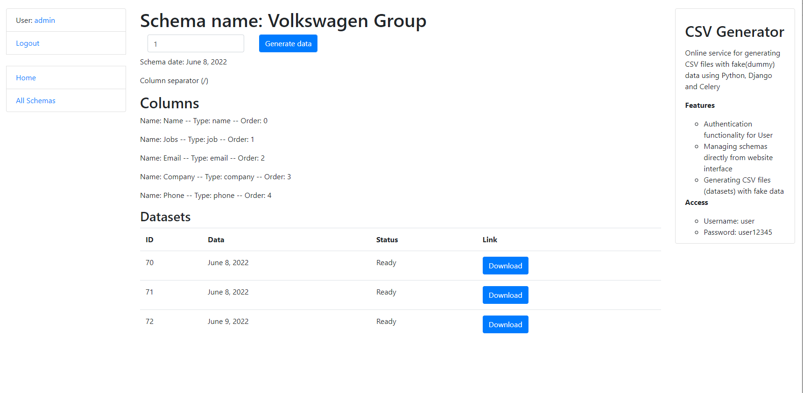

# CSV Generator APP

Online service for generating CSV files with fake(dummy)
data using Python, Django and Celery

## Check it out!

[CSV Generator APP deploy to Heroku](https://csv-generator-application.herokuapp.com)

## Installation

Python3 must be already installed

```shell
git clone https://github.com/denyslipin/Taxi-Service
python3 -m venv venv
source venv/bin/activate - on macOS (venv\Scripts\activate - on Windows)
pip install -r requirements.txt
python3 manage.py migrate
python3 manage.py runserver

Open new terminal:
celery -A app worker -l info --pool=solo
```

## Features

* Authentication functionality for User
* Managing schemas directly from website interface
* Generating CSV files (datasets) with fake data

## Access

* Username: user
* Password: user12345

## Demo


